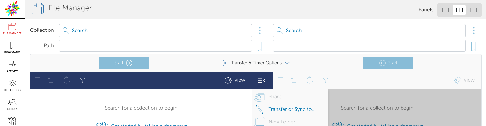
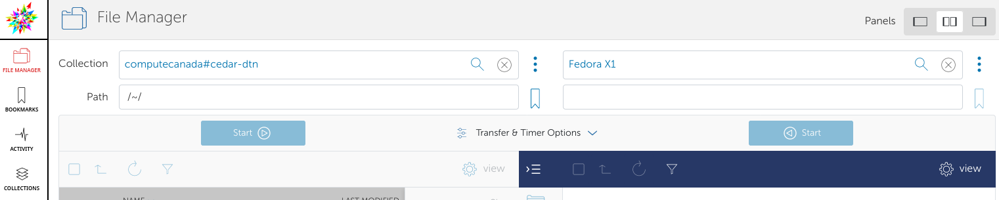
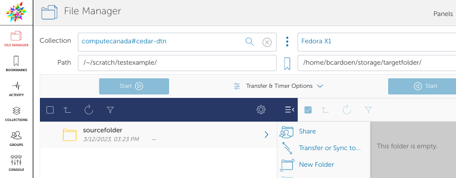
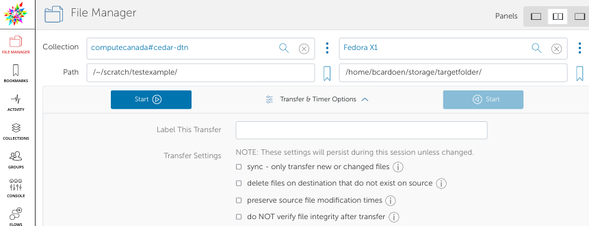
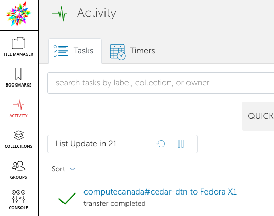

# Walkthrough
This walkthrough helps you get started in 5-10 minutes using Globus to efficiently sync, copy, and download large datasets to and from clusters, as well as between any two computers, using a web browser only.

## Table of Contents
1. [Requirements](#requirements)
2. [Installation](#installation)
3. [Step by step guide](#steps)
4. [Troubleshooting](#faq)

## Requirements
- A Digital Research Alliance account: https://ccdb.computecanada.ca/security/login
- As a student you will need your PI's CCRI (identifier)

## Installation
Install [Globus] https://docs.globus.org/globus-connect-personal/ on your machine, all OS'es are supported.
Go through the steps of the wizard to configure.

## Step-by-step guide
### Step 1
Browse to [login page](https://globus.computecanada.ca/file-manager)
Use your DRA account in the dropdown list.

### Step 2
In the File manager overview, you'll see something like this:

Select in the left hand panel on "Collection" an endpoint. 
For example, if you want to transfer data from Cedar to your laptop, you'd select something like the below:

Here I named my endpoint (laptop) **Fedora X1** when I installed Globus on my laptop.

### Step 3
Select data to be sent in the left hand side by marking with a checkbox.
Once you're happy, click the "Start" button **in the right direction**. 

Select data you want to transfer

You can change the options, e.g. overwrite, sync, fail on first error, and so on. 
You can also schedule transfers

To view status of your transfer, click 'Activity' to see detailed progress for each transfer.

Click on each transfer to get a live breakdown of total data to transfer, number of files and current speed.

That's it, you'll get a notification once done. 

## Troubleshooting
- Your endpoint (e.g. your laptop) needs to be online and have Globus running
- You do not need to use a browser on the endpoint. For example, you can schedule a transfer between a system in Vancouver and London from a browser in Hawaii.

Any further questions, please see the extensive documentation:
- https://docs.globus.org/globus-connect-personal/
- https://docs.alliancecan.ca/wiki/Globus
